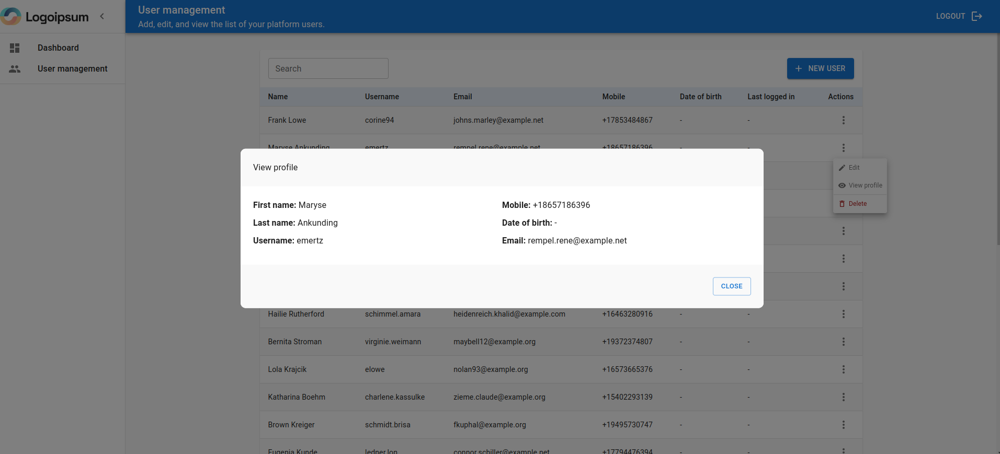

## CFP Energy Technical Test

This project was developed as part of the technical test for CFP Energy.

## About the Repository

This repository consists of the implementation of a user management system (a simple CRUD) and a dashboard with details about registered users. It is divided into two parts:

- [Backend](https://github.com/marcioal1991/user-manager/tree/main/app)
- [Frontend](https://github.com/marcioal1991/user-manager/tree/main/frontend-app)

Note: The repository uses the standard Laravel directory structure, with the frontend added in a separate directory.

### Backend
The backend utilizes [Laravel 10](https://laravel.com/docs/10.x/installation) and [PHP 8.3](https://www.php.net/releases/8.3/en.php) along with the following auxiliary packages:
 - [Laravel Sanctum](https://laravel.com/docs/10.x/sanctum)
 - [Laravel Telescope](https://laravel.com/docs/10.x/telescope) 
 - [Predis](https://github.com/predis/predis)

### Frontend
The frontend is built using [React 18](https://react.dev/)  and [MUI](https://mui.com/) (a React library for Material Design System). Key additional packages used include:

 - [Axios](https://axios-http.com/) (for asynchronous requests))
 - [Formik](https://formik.org/) (a library for form building)
 - [Yup](https://www.npmjs.com/package/yup) (form input validation builder)
 - [React Router](https://reactrouter.com/en/main)
 - [Lodash.debounce](https://lodash.com/docs#debounce)
 - [React scripts](https://www.npmjs.com/package/react-scripts)


## Development Environment

The development environment uses Docker containers to run the application and is structured as follows:
- A private network named  ```cfp-energy```
  - Container for Nginx web server
  - Container for PHP FastCGI (php-fpm)
  - Container containing a Redis instance
  - Container containing the PostgreSQL database
  - Container for the React application

Each container has an internal Docker IP, and only necessary ports are exposed (the database port is exposed for development tools, but it can be closed for the application).

## Getting Started
Within the repository, a folder named bin was created containing a script to set up the development environment. Simply execute the following command in the terminal (for Unix environments):
```bash
$ ./bin/install
```
Note: You will be prompted for your user password only to grant permission for the Laravel ```storage``` folder.

During the project build process, you will be asked to create a user to use within the application, as shown in the following image:


Afterward, simply wait for the frontend build to complete, which will be accessible at http://localhost:3000.

## Project Overview
The project communicates via API provided by the Laravel application and consumed by the React application.

The permission system consists of two roles: superadmin and normal user.
- Superadmin: can create, delete, view, and update any user, filter the list, and also view dashboard information.
- Normal user: can only view other users, filter the list, and perform login and logout actions.

## Interface
### Login

### Dashboard

### User list

### Create a new user

### View user

### Edit user

### Remove User


## Testing
Endpoint tests have been implemented in the application. To run them, execute the following command:
```bash 
$ docker exec -it php_fpm bash -c "php artisan test"
```
